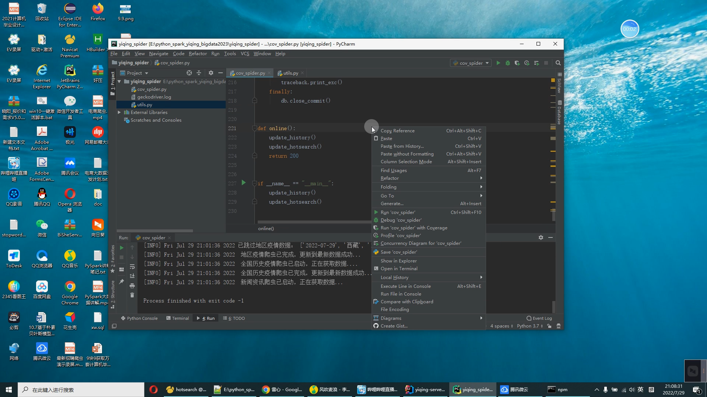
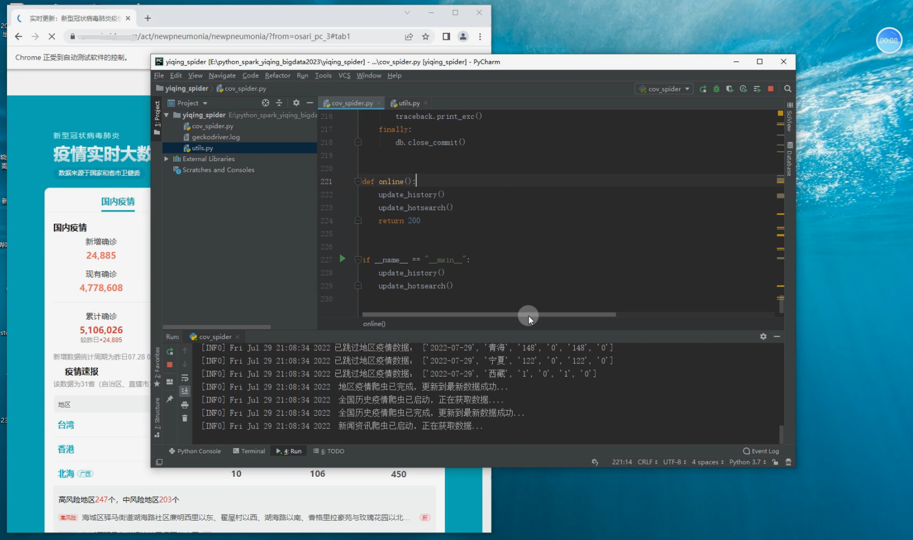
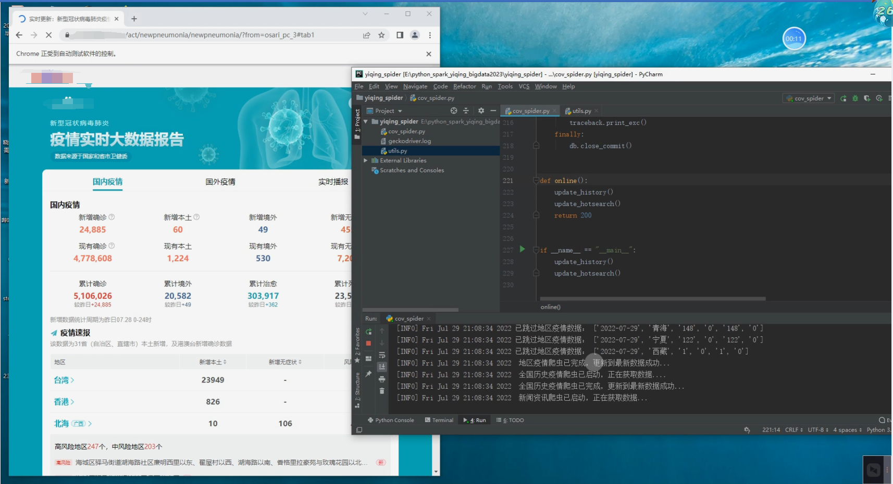
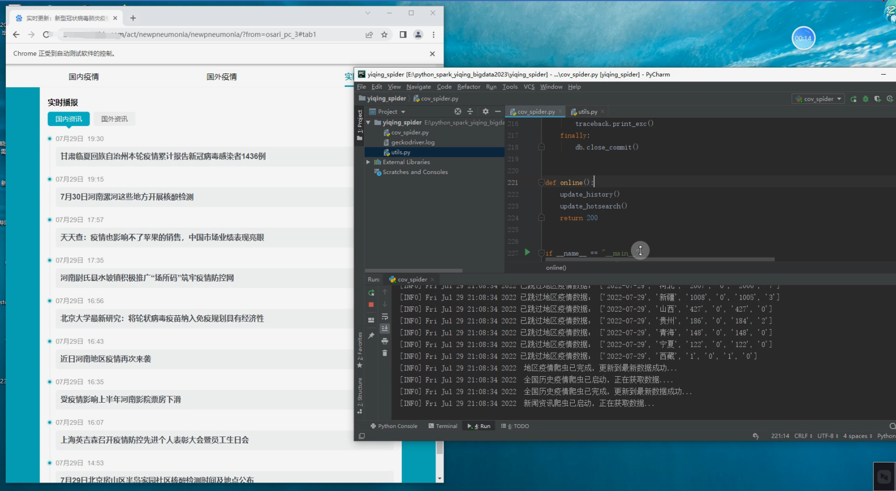
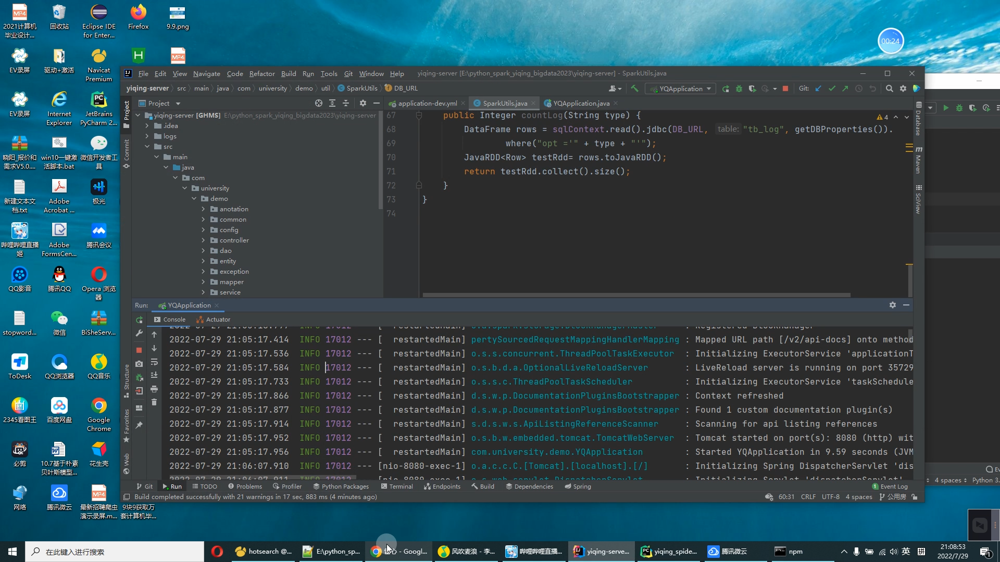
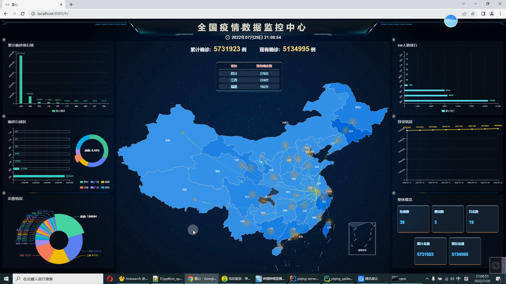
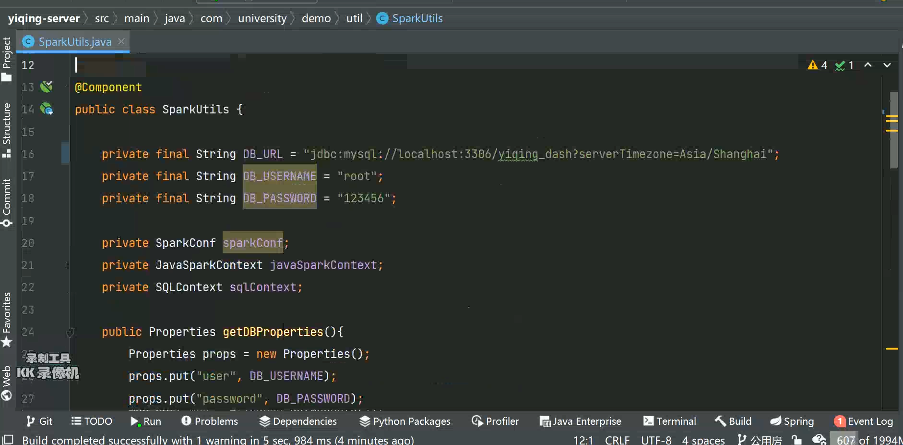

## [计算机毕业设计之Python+Spark疫情大屏可视化 疫情爬虫可视化 疫情数据分析 大数据毕业设计

## 要求
### 源码有偿一套(论文 PPT 源码+sql脚本)
### 
### 加好友前帮忙start一下，并备注github有偿获取源码
### 我的QQ号是2877135669 或者 1679232425
### 加qq好友说明（被部分  网友整得心力交瘁）：
    1.加好友务必按照格式备注
    2.避免浪费各自的时间

## 开发技术

前端：vue.js echarts websocket

后端API：springboot+spark+mybatis

数据库：mysql

爬虫：python chrome_driver

## 创新点

Spark大屏 Python爬虫 websocket

## 运行截图

# 运行视频

hhttps://www.bilibili.com/video/BV1ed4y1D7ay?spm_id_from=333.999.0.0